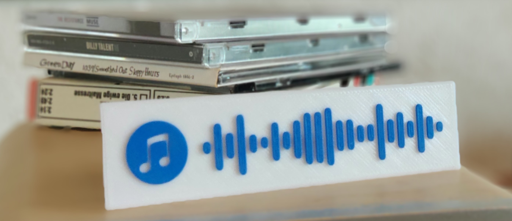

# MusiCodes3D

MusiCodes3D can generate 3D-printable codes, which you can scan with your Spotify mobile app. 
The codes link directly to your favorite song, album, playlist, etc. on Spotify.

Give it a try:

## How to create a 3D-model

    python musicodes.py <options> <spotify_url>

Examples:

    python musicodes.py -s spotify:track:4uLU6hMCjMI75M1A2tKUQC
    python musicodes.py -sp https://open.spotify.com/track/4uLU6hMCjMI75M1A2tKUQC

You can either use the web URL or the Spotify URI (click on More -> Share -> copy Spotify URI)
   
|  Options|  |
|--|--|
| -p &nbsp;&nbsp; --preview | Show a preview of the 3D-mesh |
| -s &nbsp;&nbsp; --split   | Splits the base and the code into two seperate files. Useful for multi-material printers |
| -h &nbsp;&nbsp; --help    | Displays a help page |

## Requirements
- Python3

Required packages:
 - numpy
 - numpy-stl
 - (matplotlib)

---

I made this project because I was curious about creating 3D-models with Python.
I don't really know what these musicodes could be used for but maybe you come up with a useful idea...
